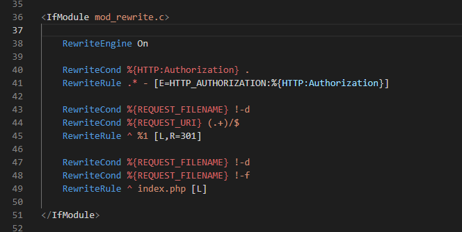

以下插件按名称顺序排列
## Apache Conf
+ 引用介绍
  Syntax highlighing for Apache conf files in Visual Studio Code. Ported from ApacheConf.tmLanguage.

+ 使用体验
   Apache的conf语法高亮，常用在 .htaccess 

   
  
<!--more-->

## Auto Close Tag

+ 引用介绍 
  Automatically add HTML/XML close tag, same as Visual Studio IDE or Sublime Text does.

+ 使用体验
  和Visual Studio IDE或Sublime Text一样，自动添加HTML/XML关闭标记。

## Auto Rename Tag
+ 引用介绍
Automatically rename paired HTML/XML tag, same as Visual Studio IDE does.
+ 使用体验
  自动重命名配对的HTML/XML标记，与Visual Studio IDE一样。
 
## Auto-Save on Window Change

+ 引用介绍
  With this extension you DON'T NEED TO press Ctrl + S anymore.
  Whenever you Alt + Tab between windows your progress is automatically saved.
+ 使用体验
  有了这个扩展，你不需要再按Ctrl + S。
   每当你Alt + Tab 切换窗口时会自动保存。
##　Code Spell Checker
+ 引用绍介
  A basic spell checker that works well with camelCase code.
 The goal of this spell checker is to help catch common spelling errors while keeping the number of false positives low.
+ 使用体验
  一个基本的拼写检查程序，可以很好地处理驼峰大小写代码。
这个拼写检查器的目标是帮助捕获常见的拼写错误，同时保持低误报的数量。
## ES7 React/Redux/GraphQL/React-Native snippets
+ 引用介绍
  This extension provides you JavaScript and React/Redux snippets in ES7 with Babel plugin features for VS Code
+ 使用体验
  这个扩展为你提供JavaScript和React/Redux片段ES7与VS Code的Babel插件功能

## ESLint

+ 引用介绍
  Integrates ESLint JavaScript into VS Code.
+ 使用体验
  查找并修复 JavaScript 代码中的问题

## Markdown Preview Enhanced

### 引用介绍:

Markdown Preview Enhanced 是一款为 Atom 以及 Visual Studio Code 编辑器编写的超级强大的 Markdown 插件。 这款插件意在让你拥有飘逸的 Markdown 写作体验。 

### 插件网址 

https://shd101wyy.github.io/markdown-preview-enhanced/#/zh-cn/ 

### 使用体验

用来编辑Markdown文档时预览功能 

---

## IntelliJ IDEA Keybindings

### 引用介绍

Port of IntelliJ IDEA key bindings for VS Code. Includes keymaps for popular JetBrains products like IntelliJ Ultimate, WebStorm, PyCharm, PHP Storm, etc.

### 插件网址

https://marketplace.visualstudio.com/items?itemName=k--kato.intellij-idea-keybindings

### 使用体验

习惯了 IntelliJ IDEA (PHPStorm) 的快捷键，安装它后常用快捷键会和PHPStorm相同

---

***待更新。。。***

